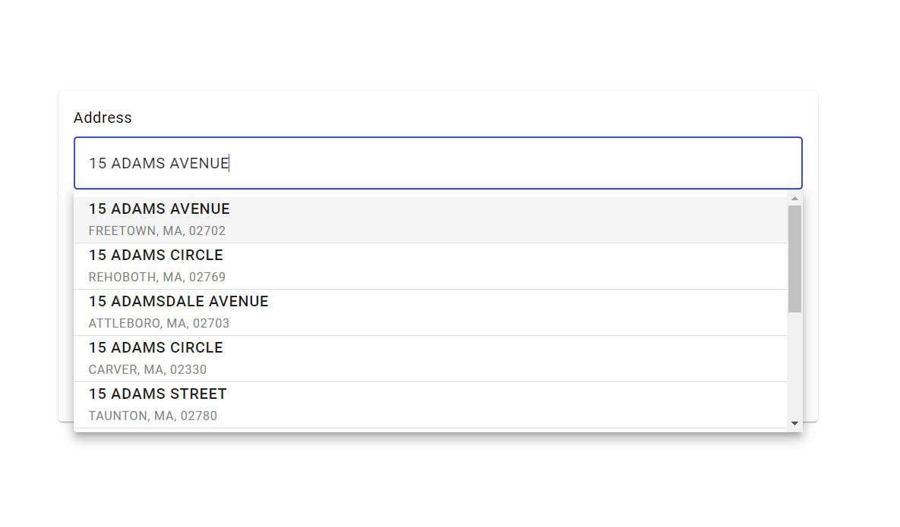
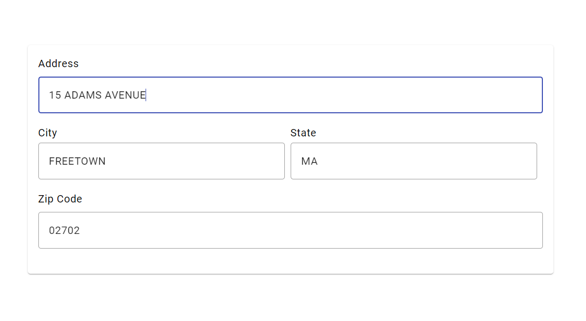

# AddressService

hoppysearch - AngularJS client for AddressService

## Installation

This project was generated with [Angular CLI](https://angular.io/cli) version 17.2.0.
### For [Angular.js](https://angular.io/cli)

#### npm    
Proceed with the installation by following these steps:

```shell    
npm install address-service-angular --save
```

## Getting Started

Please follow the [installation](#installation) instruction and execute the following AngularJS code:

#### Begin with the initial setup process:

1. Add Angular Material to your project:

#### cmd 

```javascript
ng add @angular/material
```

2. Install the required Axios library:

#### cmd 

```javascript
npm i axios
```

3. Install the address-service-angular package in your Angular project:

#### cmd 

```javascript
npm i address-service-angular
```

4. Import the AddressServiceAngularComponent in your Angular component:

#### typescript

```javascript
import { AddressServiceAngularComponent } from 'address-service-angular';
```

5. Add the component to your Angular module imports:

#### typescript

```javascript
@Component({
        imports: [RouterOutlet, AddressServiceAngularComponent],
})
```

6. Add the component tag in your HTML file:

#### HTML

```javascript
<lib-address-service-angular></lib-address-service-angular>
```

7. And Run ng serve for a dev server. Navigate to http://localhost:3000/. The application will automatically reload if you change any of the source files.

```javascript
ng serve
```
#### You will get such a result:

1. You can type the address you want to search here.


2. Now click on the address you want.
